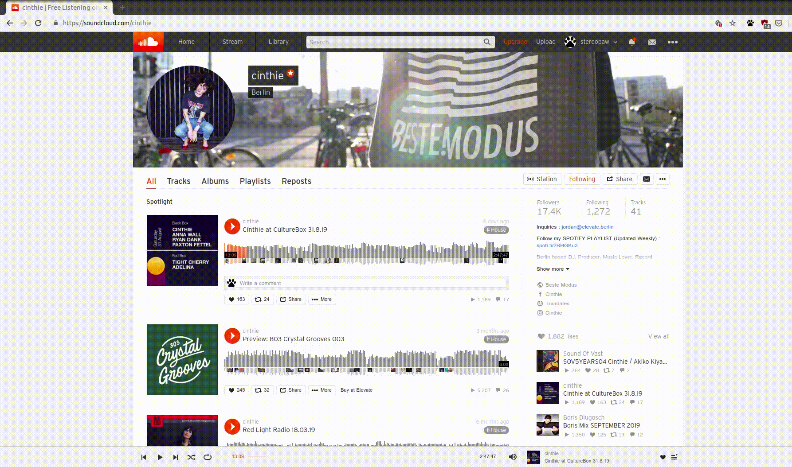

# stereopaw

## Streaming Music Bookmark Side Project




----

### Contents

stereopaw is a monorepo consisting of three main applications:

* Rails API host + Backbone.js SPA web service [app](app)
* Browser bookmarklet [marklet](marklet)
* Chrome extension [extension+chrome](chrome_extension)

### Website

The Rails website consists of Backend models with API endpoints
serving a Backbone.js single page app.

The Backbone app is found
in [app/app/assets/javascripts/app](app/app/assets/javascripts/app)

* The _/routers_ subdirectory gives an overview of the SPA.
* Many of the components rely on a global event bus, where components
  listen to a variety of triggers.
* Backbone Views use JST templates found in
  _app/assets/javascripts/templates/_, which are preprocessed by
  haml-coffee-assets. For some reason I thought was a good idea.

The Rails app contains CRUD endpoints for the various models, and a
bunch of setup to use devise with a SPA app. There's also some some
additional search logic that uses *pg_search*.


### Marklet

The marklet is a large POJO (plain javascript object) that sniffs the
DOM of the audio playing service. It plucks the appropriate metadata
and timestamp, displaying it on a panel, and later sent to the backend.

It's meant to be light and simple.


### Extension

The
[chrome extension](https://chrome.google.com/webstore/detail/stereo-paw/gcgoenndigjegpgpfnnmgfnbiollgimk) is
a convenience wrapper that loads the bookmarklet. There is no
additional functionality besides placing the bookmarklet code in the
DOM.

There used to be some message passing for a few audio services but
those are no longer supported.


#### Popularity Calc

Trys to favor newer tracks, don't necessarily want to show same things.

```
age = (( (timestamp.today - track.created_at_timestamp) / 3600 ) + 2) ^ 1.2

popularity = track.num_plays / age

```


----

## Quick commands

As I am ever so forgetful; some quick refresher commands:

```
#
# dev env: loads db +  rails app stack
#

sudo docker-compose up


# deploy to prod
# run capitastrano with ssh forwarding
# might need to add the key to keyring (ssh-add)
# .env are symlinked

sudo docker-compose run -e "SSH_AUTH_SOCK=/ssh-agent" \
    -v $SSH_AUTH_SOCK:/ssh-agent web bundle exec cap production deploy


#
# misc helpful dev commands
#

sudo docker-compose run web bash

sudo docker-compose build


```

----

## Dev Environment

Docker contains the rails and nodejs executables and various
dependencies (ruby, gems, installed node_modules, etc.)

The app code for stereopaw (rails app, marklet, chrome extension) is
bind mounted into the container.

The container runs additional db migration and asset pipeline commands
through ```entrypoint.sh```. But server command is run from
```docker-compose.yml```, which is the intended development
environment executable.

Docker isn't used for production (old school capistrano) but only to
spin up a dev environment.


### Rails and Docker Dev Environment

```
# run rails stack

sudo-docker-compose up

```

### Marklet & Chrome Extension Build

```
# build marklet:
# minifies marklet code to be distributed in the rails _public_ directory
# dev, prod environments respectively

sudo docker-compose run -w /stereopaw/marklet web grunt
sudo docker-compose run -w /stereopaw/marklet web grunt prod

#
# build extension bundle found in _extension_chrome/dist_
# dev, prod

sudo docker-compose run -w /stereopaw/extension_chrome web grunt
sudo docker-compose run -w /stereopaw/extension_chrome web grunt prod

```


#### Dockerfile Builds / docker-compose

Caching ```bundle install```:

* A full bundle install is extremely expensive and time consuming for
  every build. Want to avoid this.
* Keep Dockerfile minimal
* place Gemfile in temp location prior to a ```bundle install``` to
  avoid triggering a dirty rebuild on minor changes.

Database Image + Docker Network:

* postgres docker image uses postgres user, need to set that in
  config/database.yml

* set 'db' as hostname for development database, as using default
  network when running via docker-compose.


#### Build Docker Image

To build the docker env, if I am unlucky to upgrade a rails app again....

```

# build dev env

sudo docker-compose build .

```

##### haml_coffee_assets and github

This dependency v 1.6.2 lives in a github repo that for reasons . . .
doesn't seem to install properly via docker-compose and whatever
version of bundler is set. A "manual" ```bundle install``` via
the ole bash-in-docker seems to work.

```
sudo docker run stereopaw/stereopaw bash
bundle install

sudo docker-compose run web bash
bundle install

```

----

## Deployment Notes

Trying to keep a minimal deployment setup, currently running on a spot
ec2 instance. Deployment is done via capistrano.

Capistrano is executed within Docker hence the ssh key forwarding.


```

sudo docker-compose run -e "SSH_AUTH_SOCK=/ssh-agent" \
    -v $SSH_AUTH_SOCK:/ssh-agent web bundle exec cap production deploy

sudo docker-compose run -e "SSH_AUTH_SOCK=/ssh-agent" \
    -v $SSH_AUTH_SOCK:/ssh-agent web bash


# rarely will need to restart nginx (memory issues on my tiny instance, etc)

service nginx restart

```

#### Delayed Job

Background worker is used to process the track submissions. Sometimes they die.

```
RAILS_ENV=production delayed_job <start|stop>
```

#### .env

* These are symlinked externally. See ```/app/.env.example```
* marklet and extension are symlinked:
  * requires own ```env.dev.json```, and .```env.prod.json``` for both
    marklet and extension_chrome.
  * See respective ```.env.example.json``` for content.


----
